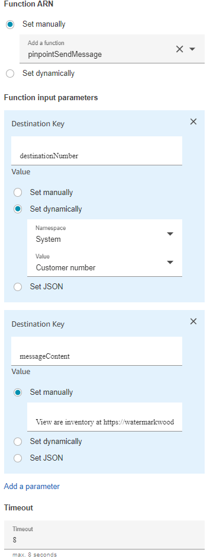

# pinpointSendMessage
A simple python lambda function to send a text via lambda for use with amazon connect

# Environment
## Runtime Settings
Python 3.9 with no layers any architecure works fine (arm64 is recommended for the lower cost)
## Permissions
In IAM create a inline policy for the auto created role for your new function 
this inline policy should have the following json set be sure to fill in your AWS Account ID
```
{
    "Version": "2012-10-17",
    "Statement": [
        {
            "Sid": "VisualEditor0",
            "Effect": "Allow",
            "Action": "mobiletargeting:SendMessages",
            "Resource": "arn:aws:mobiletargeting:*:[AWS-ACCOUNT-ID]:apps/*"
        }
    ]
}
```

## Environment variables
| name | value |
| -- | -- |
| source_number | your pinpoint sms number |
| pinpoint_appid | your pinpoit app id |

# Amazon Connect
## Tying your function to connect 
In the [connect portal](console.aws.amazon.com/connect) click on you connect instance, then go to Contact flows on the left navigation bar. In the AWS Lambda section select our newly create lambda function from the Lambda Functions dropdown. Click Add Lambda Function.
## Sending a SMS message from connect
Open up the flow you want to send a message in. From the blocks toolbox navigate to the Integrate section then drag the Invoke Lambda function to your flowchart. From the function ARN section use Set manually then choose our pinpointSendMessage function. Update the timeout field to be 8 second. Change the responce validation to JSON.
then in the parameters section click on the Add a parameter button twice. In the first section set the Destination Key field to be destinationNumber, set the value to be Set dynamically, Namespace: System, Value: Customer number. In the second section set the Destination Key field to be messageContent, set the value to be Set manually, then fill in your desired message. Connect in your block like any other function. I recommend that you connect the success to a audio prompt notifying the caller that the message has been sent.  

